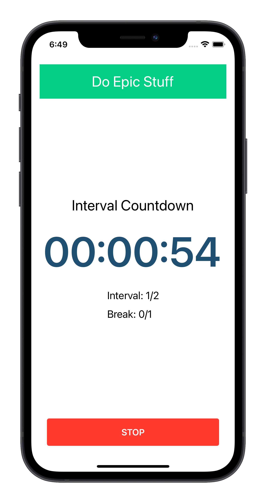
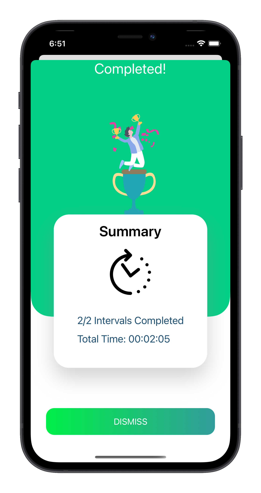

# Kristijan Kralj - Portfolio

_"Be yourself; everyone else is already taken."_ - **Oscar Wilde**

Hi, my name is Kristijan. I am a software developer with almost a decade of experience in developing professional apps. This portoflio brings some of the recent mobile projects I was working on (_aka the brag page, heh_).

## Repeatify

Repeatify is a simple countdown timer for all your workout routines.

[View on AppStore](https://apps.apple.com/us/app/repeatify/id1538289182)

### Tech Stack: 

- SwiftUI
- MVVM
- Swift Package Manager
- Lottie Animations
- Unit Tests
- Fastlane
- UI Test for Screenshot Taking

  
  

## Stacy

Stacy is a roommate finding app. Think Tinder, but for roommates.

[View on AppStore](https://apps.apple.com/us/app/stacy/id1535525926)

### Tech Stack: 

- SwiftUI
- MVVM
- Swift Package Manager
- Firebase Auth
- Firebase Cloud Firestore
- Lottie Animations
- Unit Tests
- Fastlane
- UI Test for Screenshot Taking

